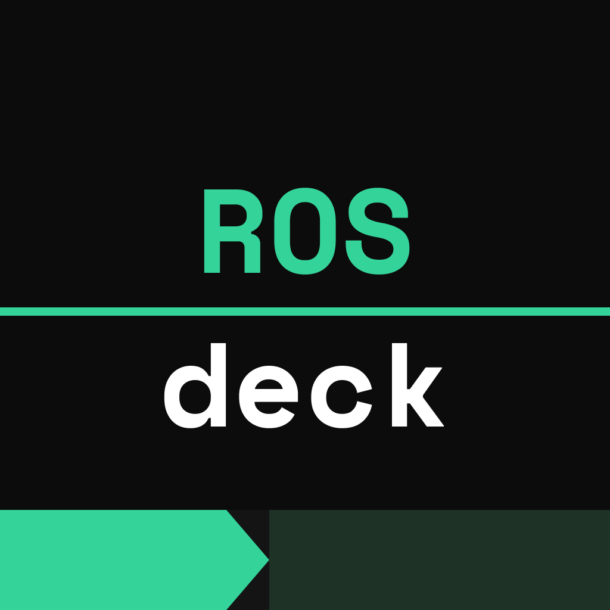
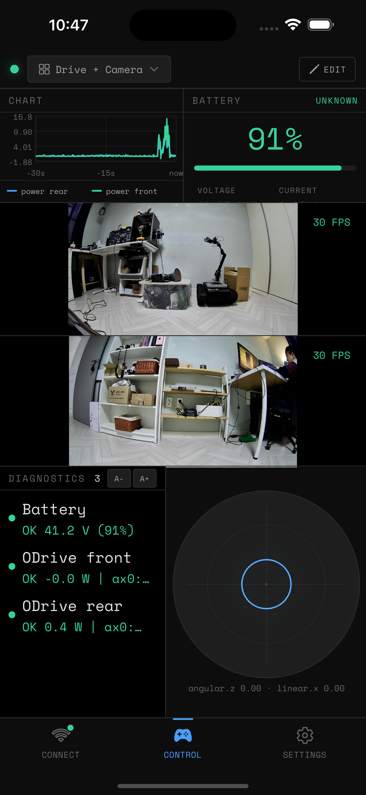

<p align="center">
  
</p>

<h1 align="center">ROSDeck</h1>

<p align="center">
  <strong>The mobile dashboard for ROS2 robots.</strong><br/>
  Teleop joystick, live camera, 2D map, Nav2 goals, diagnostics, and gamepad support — all from your phone.<br/>
  Connect over WiFi via rosbridge or Foxglove. No DDS, no VPN, no laptop required.<br/><br/>
  <a href="https://rosdeck.github.io">Sign up for the beta</a> or build it yourself.
</p>

<p align="center">
  
  
  
</p>

---

<p align="center">
  
  
</p>

## Why ROSDeck?

[ROS-Mobile](https://github.com/ROS-Mobile/ROS-Mobile-Android) was the go-to for ROS1 (500+ stars, 13K+ downloads, 4.5+ rating) but is stuck on ROS1, which hit EOL in May 2025. ROS2 adoption is growing fast with no polished mobile equivalent. ROSDeck fills that gap — a native, cross-platform app purpose-built for ROS2.

## Features

- **Teleop joystick** — virtual thumbstick publishing `Twist` / `TwistStamped` with configurable axes and velocity scaling
- **Bluetooth gamepad support** — connect an Xbox, PS5, or generic BT controller; auto-maps sticks to joystick widgets with configurable deadzone and layout
- **Live camera** — subscribe to `CompressedImage` topics or connect to an MJPEG stream
- **2D map** — render `OccupancyGrid`, overlay `LaserScan` point clouds, show robot pose from TF
- **Nav2 integration** — tap the map to publish goal poses
- **Rosbridge & Foxglove** — connect via `rosbridge_server` (port 9090) or `foxglove_bridge` (port 8765), no DDS configuration needed
- **Customizable layouts** — tmux-style split panes, swap and resize widgets, save/load per robot
- **Auto-layout** — detects available topics on connect and suggests a matching layout
- **Demo mode** — try the full app without a robot

### Widgets

| Category | Widget       | Message Type                              |
| -------- | ------------ | ----------------------------------------- |
| Control  | Joystick     | `geometry_msgs/Twist`, `TwistStamped`     |
| Sensor   | Camera       | `sensor_msgs/CompressedImage`, `Image`    |
| Sensor   | Battery      | `sensor_msgs/BatteryState`                |
| Sensor   | IMU          | `sensor_msgs/Imu`, `MagneticField`        |
| Sensor   | Line Chart   | Any numeric topic field                   |
| Nav      | Map          | `nav_msgs/OccupancyGrid` + TF + LaserScan |
| Debug    | Topic Viewer | Any topic (raw JSON)                      |
| Debug    | Rosout       | `rcl_interfaces/Log`                      |
| Debug    | Diagnostics  | `diagnostic_msgs/DiagnosticArray`         |
| Debug    | TF Tree      | `/tf`, `/tf_static`                       |

The map widget supports Nav2 goal pose publishing, costmap overlays, and laser scan visualization.

## Getting Started

### Prerequisites

- Node.js and npm
- [Expo CLI](https://docs.expo.dev/get-started/installation/)
- A ROS2 robot running `rosbridge_server` or `foxglove_bridge`

### Robot Setup

```bash
# Install rosbridge
sudo apt install ros-${ROS_DISTRO}-rosbridge-suite

# Launch it
ros2 launch rosbridge_server rosbridge_websocket_launch.xml
```

### App Setup

```bash
git clone https://github.com/baunuri/rosdeck.git
cd rosdeck
cp app.json.example app.json
cp eas.json.example eas.json
npm install
npm start
```

Edit `app.json` with your own `slug`, `bundleIdentifier`, `package`, and EAS `projectId` before building.

### Build

```bash
npm run build:android-debug        # Debug APK
npm run build:android-preview      # Release APK
npm run build:android-production   # AAB for Play Store
```

## Tested With

- TurtleBot4 (Gazebo simulation)
- [SMUB](https://blog.podri.org/2022/08/21/SMUB/) (Super Mega Ultra Bot, a DIY rover robot)
- A generic smartphone Bluetooth gamepad controller

Works with any ROS2 robot that runs a WebSocket bridge (Humble, Jazzy, Rolling).

## Architecture

```
app/(tabs)/           # Three-tab UI: Connect, Control, Settings
widgets/              # Widget definitions and components
stores/               # Zustand state management
lib/                  # Transport layers (rosbridge, foxglove, demo)
hooks/                # React hooks (cmd_vel publisher, gamepad input, orientation)
modules/expo-gamepad/ # Native Expo module for Bluetooth gamepad input (Kotlin + Swift)
components/           # Shared React Native components
types/                # TypeScript interfaces
```

### Tech Stack

- **React Native** (Expo SDK 55) — cross-platform native app
- **TypeScript** — type-safe codebase
- **Zustand** — lightweight state management
- **roslibjs** — rosbridge WebSocket protocol
- **@foxglove packages** — Foxglove WebSocket protocol with CDR serialization
- **react-native-skia** — high-performance canvas rendering for map and laser scan
- **react-native-reanimated** — smooth joystick and UI animations

## License

GPLv3 — see [LICENSE](LICENSE).

You can build and use this app freely. If you distribute a modified version, you must open-source your changes under the same license.
